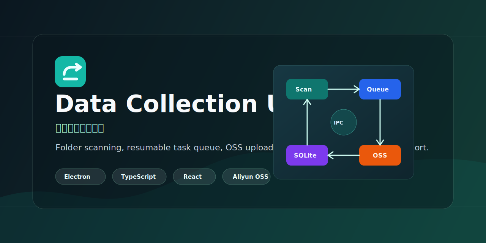
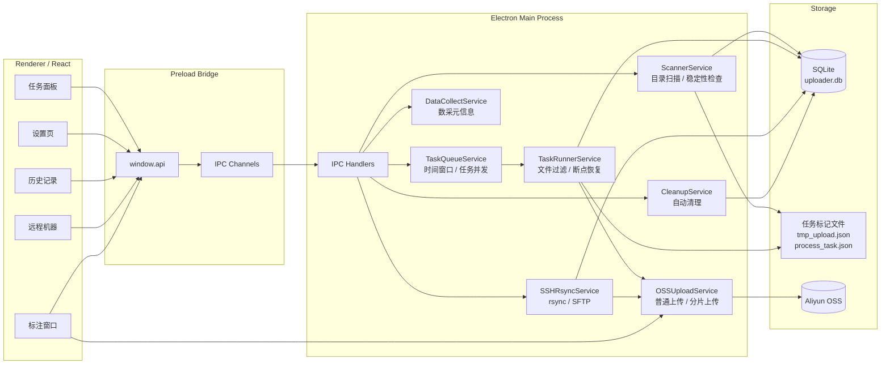

<p align="center">
  
</p>

<h1 align="center">数据采集上传工具</h1>

<p align="center">
  面向工业数据采集现场的文件夹扫描、任务化上传、远程同步与标注导出桌面工具。
</p>

<p align="center">
  <a href="package.json"></a>
  
  
  
  
  <a href="LICENSE"></a>
</p>

<p align="center">
  <a href="#功能特性">功能特性</a> ·
  <a href="#系统架构">系统架构</a> ·
  <a href="#快速开始">快速开始</a> ·
  <a href="#打包发布">打包发布</a> ·
  <a href="docs/">完整文档</a>
</p>

面向工业数据采集场景的 Electron 桌面应用，支持自动扫描文件夹、任务化上传阿里云 OSS、断点恢复、远程机器同步、历史管理、自动清理和图片标注导出。

这个项目适合用于采集机数据归档、焊接/视觉数据上传、批次目录同步、内网设备数据拉取等场景。它的重点不是单次手动上传，而是把“目录发现 -> 稳定性检查 -> 任务调度 -> 并发上传 -> 状态留档 -> 失败恢复”做成一条可观察、可恢复的桌面工作流。

## 功能特性

- 自动扫描目录，并通过多轮稳定性检查避免上传写入中的文件夹
- 任务状态管理：`pending` / `scanning` / `uploading` / `completed` / `failed` / `paused`
- 支持手动添加任务、暂停、恢复、取消和失败重试
- 支持上传时间窗口，可配置开始时间、结束时间和跨天窗口
- 三层并发控制：任务并发、单任务文件并发、全局文件上传并发
- 阿里云 OSS 上传，支持小文件普通上传和大文件分片上传
- 文件过滤规则：白名单、黑名单、正则排除、后缀过滤
- SSH 远程机器管理，支持连接测试、`rsync` 拉取和 SFTP 直传 OSS
- SQLite 本地持久化，保留任务、文件、设置、远程机器和历史状态
- 自动清理已完成的本地目录，支持按来源和保留天数控制
- 数采模式，可提取焊接采集目录中的相机、信号、机器人状态和标注元信息
- 独立图片标注窗口，支持导出 PNG + JSON 并上传 OSS
- 安全的 Electron 进程模型：`contextIsolation=true`，渲染进程通过 preload IPC 访问主进程能力

## 系统架构



核心链路是：扫描器发现稳定目录后创建任务，队列按时间窗口和并发限制启动任务，执行器过滤文件并上传 OSS，同时把任务状态写入 SQLite 和目录标记文件。

## 技术栈

| 模块 | 技术 |
| --- | --- |
| 桌面框架 | Electron + electron-vite |
| 语言 | TypeScript |
| 前端 | React + React Router + Zustand |
| 样式 | TailwindCSS |
| 数据库 | SQLite / better-sqlite3 |
| 对象存储 | ali-oss |
| 远程传输 | ssh2 / rsync / SFTP |
| 标注画布 | Konva / react-konva |
| 打包 | electron-builder |

## 项目结构

```text
.
├── docs/                  # docsify 项目文档
├── pre_upload_logic_code/ # 早期数采逻辑参考脚本
├── resources/             # 应用图标等打包资源
├── src/
│   ├── main/              # Electron 主进程：IPC、数据库、扫描、上传、远程同步
│   ├── preload/           # contextBridge 安全桥接
│   ├── renderer/          # React 页面、组件、状态管理、标注子应用
│   └── shared/            # 主进程和渲染进程共享类型与常量
├── electron-builder.yml   # 打包配置
├── electron.vite.config.ts
└── package.json
```

## 环境要求

- Node.js 18+，建议 Node.js 20 LTS
- npm 9+
- Linux 或 Windows
- 阿里云 OSS Bucket 及可写入的 AccessKey
- 可选：`rsync`，用于远程机器拉取
- 可选：`sshpass`，用于 rsync 密码认证场景

Ubuntu / Debian 可安装远程同步依赖：

```bash
sudo apt-get update
sudo apt-get install -y rsync sshpass
```

## 快速开始

```bash
npm install
npm run dev
```

启动后进入“设置”页完成基础配置：

1. 填写 OSS `Endpoint`、`Region`、`Bucket`、`AccessKey ID`、`AccessKey Secret`。
2. 点击“测试连接”，确认 Bucket 可访问。
3. 添加扫描目录。扫描目录应是批次文件夹的父目录。
4. 根据网络和机器性能调整上传并发。
5. 如不需要上传时间限制，可关闭开始时间和结束时间。
6. 返回“任务面板”，点击“触发扫描”或等待自动扫描。

## 常用命令

```bash
npm run dev              # 启动开发环境
npm run typecheck        # TypeScript 类型检查
npm run lint             # ESLint 检查
npm run build            # 构建主进程和渲染进程
npm run preview          # 预览构建结果
npm run build:linux      # 构建 Linux AppImage 和 deb
npm run build:win        # 构建 Windows 安装包
npm run build:all        # 构建 Linux 和 Windows x64 产物
```

## 打包发布

### Linux

```bash
npm run build:linux
```

产物输出到 `dist/`，包含 AppImage 和 `.deb`。

安装 `.deb` 示例：

```bash
sudo dpkg -i electron-uploader_2.0.1_amd64.deb
sudo apt-get -f install -y
```

### Windows

```bash
npm run build:win
```

Windows 产物由 `electron-builder` 根据 `electron-builder.yml` 生成。

## 使用说明

### 本地自动上传

配置扫描目录后，应用会扫描该目录下的子目录。每个子目录会在稳定性检查通过后成为一个上传任务。

```text
/data/upload-root/
  batch-001/
    camera1/0001.jpg
    meta.json
```

如果 OSS prefix 为 `upload/`，上传后的对象路径类似：

```text
upload/batch-001/camera1/0001.jpg
upload/batch-001/meta.json
```

### 上传时间窗口

上传时间窗口只影响新任务启动，不会中断正在上传的任务。

- 开始和结束都关闭：全天可启动任务
- 只设置开始时间：到达开始时间后可启动
- 只设置结束时间：结束时间前可启动
- 开始晚于结束：按跨天窗口处理，例如 `20:30-06:00`

### 远程机器同步

远程机器支持两种模式：

| 模式 | 说明 | 推荐场景 |
| --- | --- | --- |
| rsync | 先拉取到本地目录，再自动创建上传任务 | 大批量文件、超大文件、需要断点能力 |
| SFTP | 通过 SFTP 读取远程文件并直接上传 OSS | 文件较小、不希望本地落盘 |

### 标注导出

任务面板可打开独立标注窗口。标注结果会导出为 PNG 和 JSON，并可上传到 OSS。如果原图属于某个上传任务，标注结果会尽量沿用原任务的 OSS 路径结构。

## 数据与日志

- 数据库：`uploader.db`，位于 Electron `userData` 目录
- 日志：默认位于 `userData/logs`
- 任务标记文件：
  - `tmp_upload.json`：目录已被扫描器登记
  - `process_task.json`：上传过程和文件状态

## 文档

更完整的架构、模块、配置和测试说明见 [docs/](docs/)。

本地预览文档：

```bash
cd docs
python3 -m http.server 4173 --bind 127.0.0.1
```

然后访问：

```text
http://127.0.0.1:4173/
```

## 常见问题

### 新目录为什么没有立刻上传？

应用会先做稳定性检查，确认目录中的文件数量、大小和修改时间不再变化后才会注册任务。如果配置了上传开始时间，任务还会等待时间窗口打开。

### 设置了结束时间，为什么任务还在上传？

结束时间只限制新任务启动。已经处于上传中的任务会继续执行，直到完成、失败、暂停或取消。

### OSS 测试连接失败怎么办？

优先检查：

- `Endpoint` 和 `Region` 是否匹配
- `Bucket` 是否正确
- AK/SK 是否有效
- RAM 权限是否允许访问目标 Bucket
- 当前网络和 DNS 是否能访问 OSS

### Linux 打包时 better-sqlite3 报错怎么办？

可以清理依赖后重新安装并打包：

```bash
rm -rf node_modules package-lock.json
npm install
npm run build:linux
```

### 哪些文件会被跳过？

- 隐藏目录中的文件
- `tmp_upload.json`
- `process_task.json`
- 命中黑名单或正则排除规则的文件
- 配置了后缀列表但后缀不匹配的文件

## 开源发布前检查

- 不要提交 `.env`、真实 AK/SK、测试 Bucket 密钥或内部服务器密码
- 不要提交 `node_modules/`、`dist/`、`out/` 等构建产物
- 确认 `package.json` 中的 `homepage`、`author` 与实际 GitHub 仓库一致
- 发布前建议执行：

```bash
npm run typecheck
npm run lint
```

## 贡献

欢迎提交 Issue 和 Pull Request。建议 PR 描述中包含：

- 问题背景或需求场景
- 主要修改内容
- 本地验证方式
- 如涉及 UI，请附截图或录屏

## 版本

当前版本：`2.0.1`

## 许可证

本项目基于 [MIT License](LICENSE) 开源。
