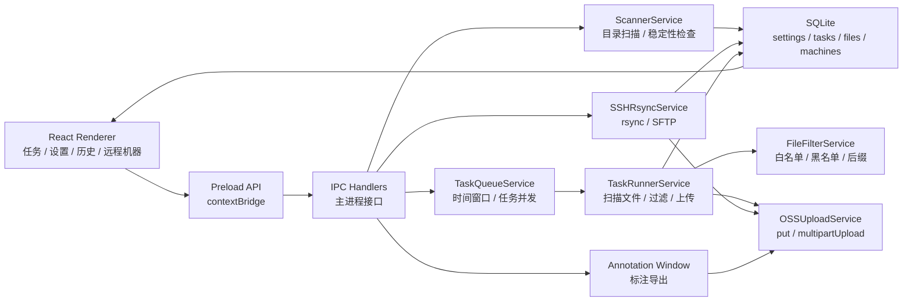

# 数据采集上传工具
----
> 面向工业数据采集现场的文件夹扫描、任务化上传与远程同步桌面工具

## 项目简介

数据采集上传工具是一个基于 Electron 的桌面应用，用来把采集机、本地测试目录或远程设备上的数据文件稳定地上传到阿里云 OSS。它不只是一个“选择文件夹然后上传”的小工具，而是把目录发现、写入稳定性确认、任务队列、文件过滤、并发上传、断点恢复、远程拉取、历史留档、自动清理和图片标注整理成了一套可运行的工程闭环。

在工业采集现场，数据经常具有这些特点：文件夹由采集程序持续写入，单个批次文件多且大小不一，上传窗口受网络或班次限制，远程机器需要低影响同步，失败后要能重试并保留原因。这个软件围绕这些场景设计，让数据从“本地生成”到“云端归档”有清晰的状态和可观察的进度。

## 核心功能

- **自动目录扫描** - 定时扫描配置目录下的子目录，跳过隐藏目录，并做多轮稳定性检查
- **任务队列调度** - 使用 `pending / scanning / uploading / completed / failed / paused` 状态机管理上传生命周期
- **上传时间窗口** - 支持开始时间、结束时间、跨天窗口，也支持关闭任一限制
- **并发控制** - 同时限制任务级并发、单任务文件并发和全局文件上传并发
- **阿里云 OSS 上传** - 小文件流式 `put`，大文件自动分片上传，并避免超大文件分片数量超限
- **断点恢复** - 通过 SQLite 文件状态和 `process_task.json` 标记恢复未完成文件
- **文件过滤** - 支持白名单、黑名单、正则排除和后缀规则，自动跳过标记文件
- **远程机器管理** - 支持 SSH 连通性测试、`rsync` 拉取落盘、SFTP 直传 OSS
- **数采模式** - 对焊接数据目录提取相机、焊接信号、机器人状态、点云和标注元信息
- **历史与清理** - 分页查看完成/失败任务，可删除历史，并按保留天数清理本地目录
- **图片标注** - 独立标注窗口支持图片加载、标注导出 PNG + JSON，并上传到 OSS

## 系统架构

## 技术栈

| 层级 | 技术 | 用途 |
| --- | --- | --- |
| 桌面运行时 | Electron / electron-vite | 主进程、渲染进程、打包发布 |
| 前端界面 | React / React Router / Zustand | 任务面板、设置、历史、远程机器、标注窗口 |
| UI 样式 | TailwindCSS / lucide-react | 页面布局、按钮图标、状态展示 |
| 本地存储 | better-sqlite3 | 任务、文件、设置、远程机器持久化 |
| 云端对象存储 | ali-oss | OSS 连接测试、普通上传、分片上传、Buffer 上传 |
| 远程传输 | ssh2 / rsync / sshpass | SSH 测试、远程目录拉取、SFTP 流式读取 |
| 标注能力 | Konva / react-konva | 图片标注画布与导出 |
| 日志 | electron-log | 运行日志、上传失败原因、清理记录 |

## 目录一览

| 路径 | 说明 |
| --- | --- |
| `src/main/` | Electron 主进程，负责 IPC、数据库、扫描、队列、上传和远程传输 |
| `src/main/services/` | 业务服务：扫描器、任务队列、OSS、SSH、数采、清理、Webhook |
| `src/main/db/` | SQLite 初始化和仓储层 |
| `src/preload/` | 安全桥接层，通过 `contextBridge` 暴露渲染进程 API |
| `src/renderer/` | React 页面、组件、状态管理和标注子应用 |
| `src/shared/` | 主进程和渲染进程共享的类型、常量、IPC 通道 |
| `pre_upload_logic_code/` | 早期 Python 数采处理逻辑参考 |
| `dist/` | Electron Builder 打包产物 |

## 快速导航

- [环境依赖与准备](guide/prerequisites.md) - 安装 Node、系统工具和 OSS 账号准备
- [开发运行](guide/run-app.md) - 本地启动 Electron 应用
- [架构总览](architecture/README.md) - 理解主进程、渲染进程和服务层关系
- [任务队列与上传执行](modules/task-upload.md) - 上传任务如何从 pending 走到 completed
- [OSS 上传服务](modules/oss.md) - 小文件、大文件、取消和连接测试逻辑
- [远程机器同步](workflow/remote-sync.md) - rsync 落盘上传和 SFTP 直传的使用流程
- [设置总览](configuration/settings.md) - 关键配置项和推荐值
- [测试验收流程](workflow/testing.md) - 从安装到增量上传的验收清单
