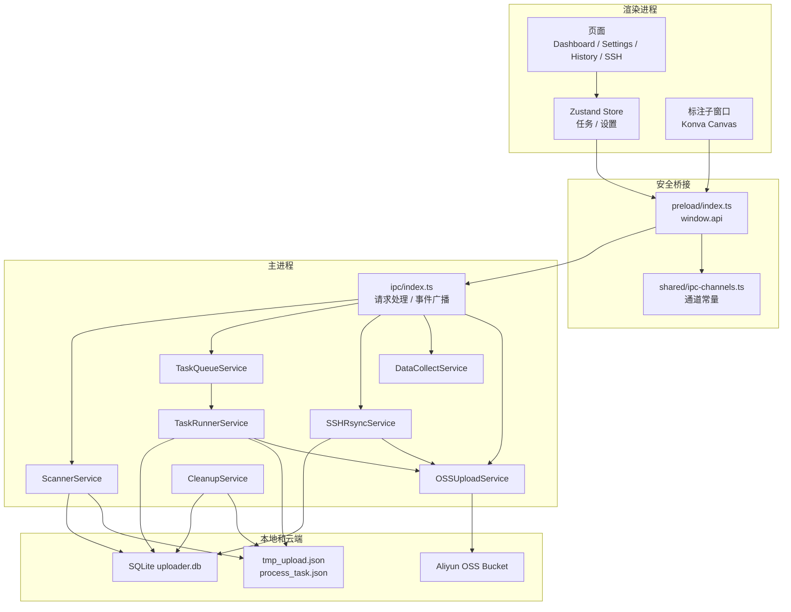

# 架构总览

## 一句话架构

这是一个 Electron 本地桌面应用：React 渲染进程负责交互，Preload 暴露安全 API，主进程承载扫描、队列、上传、远程传输和数据库访问，SQLite 负责本地状态留档，阿里云 OSS 是最终数据归档目标。

## 分层视图

## 主进程职责

主进程是整个应用的控制中心。它负责：

- 初始化窗口、数据库、日志和服务
- 注册 IPC handler，为前端提供任务、设置、历史、远程机器等操作
- 接收扫描触发、任务控制、OSS 测试、标注上传等请求
- 向所有渲染窗口广播任务进度、任务状态、扫描状态、远程传输进度
- 把长期状态写入 SQLite，把任务目录状态写入标记文件

## 渲染进程职责

渲染进程只做展示和用户交互，不直接访问 Node 文件系统或数据库。主要页面是：

- `Dashboard`：任务面板、扫描计划、磁盘用量、数采结果、近期完成任务
- `Settings`：自动保存扫描、上传、OSS、过滤、清理等配置
- `History`：查看、删除和清空完成/失败记录
- `SSHMachines`：添加远程机器、测试连接、触发传输
- `AnnotationApp`：图片标注、PNG/JSON 导出、OSS 上传

## 状态持久化

系统使用两类持久化：

| 类型 | 位置 | 内容 |
| --- | --- | --- |
| SQLite | Electron `userData/uploader.db` | 任务、文件、设置、远程机器、历史查询基础数据 |
| 标记文件 | 任务目录内部 | `tmp_upload.json` 记录目录已发现，`process_task.json` 记录上传过程 |

SQLite 负责应用级查询和断点恢复；标记文件负责让任务目录自己带有处理痕迹，避免扫描器重复把同一目录当成新目录。

## 设计重点

- 写入中的目录不会立即上传，而是先做稳定性检查。
- 时间窗口只控制“新任务是否启动”，不会中断正在上传的任务。
- 每个任务拥有独立 OSS client，取消任务时尽量不影响其他任务。
- 并发限制分三层：任务并发、单任务文件并发、跨任务全局上传并发。
- 手动添加的任务不会被自动清理，避免误删用户主动选择的目录。
