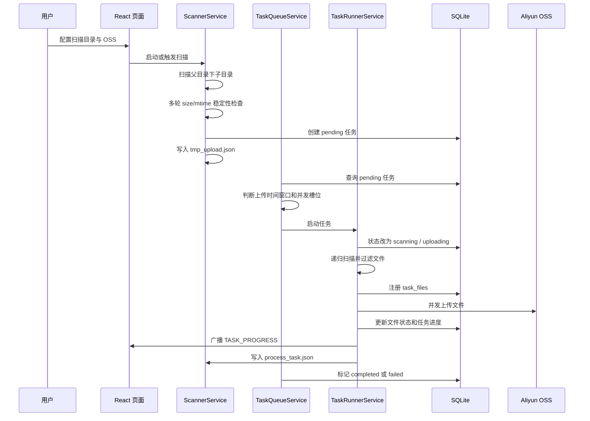
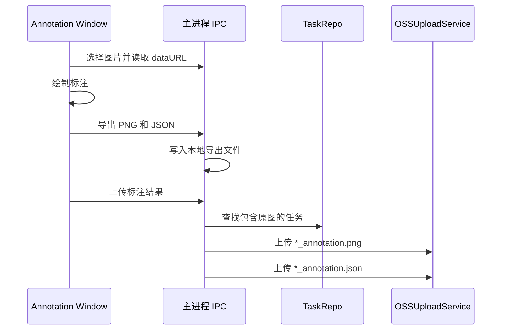

# 数据流

## 自动扫描上传流

## 远程 rsync 流

rsync 模式适合远程机器先把数据落到本机，再进入普通任务上传链路。

rsync 完成后，应用会自动为 `localDir` 创建上传任务，并把来源记录为 `rsync`。

## SFTP 直传流

SFTP 模式适合不希望在本地落盘的场景。服务会递归列出远程目录中的文件，通过 SFTP 读取 Buffer，然后调用 OSS Buffer 上传。

当前实现会把单个文件读取成 Buffer 后上传，因此超大单文件场景更推荐使用 rsync 落盘上传，让 OSS 分片上传逻辑接管。

## 标注上传流

如果原图属于某个任务目录，标注结果会沿用任务的 OSS 前缀和文件相对路径；如果匹配不到任务，则使用配置里的 OSS 前缀加图片名。

## 进度事件流

主进程通过事件向渲染窗口推送进度：

| 事件 | 来源 | 内容 |
| --- | --- | --- |
| `task:progress` | `TaskRunnerService` | 已上传文件数、字节数、速度、当前文件 |
| `task:status-change` | `TaskQueueService` / IPC 操作 | 任务状态变化 |
| `scanner:event` | `ScannerService` | 扫描器运行状态、待稳定目录、最近扫描结果 |
| `rsync:progress` | `SSHRsyncService` | rsync 百分比、速度、当前输出行 |
| `sftp:progress` | `SSHRsyncService` | SFTP 文件总数、已传数量、当前文件 |
| `data-collect:result` | `ScannerService` / IPC | 数采元信息 |
