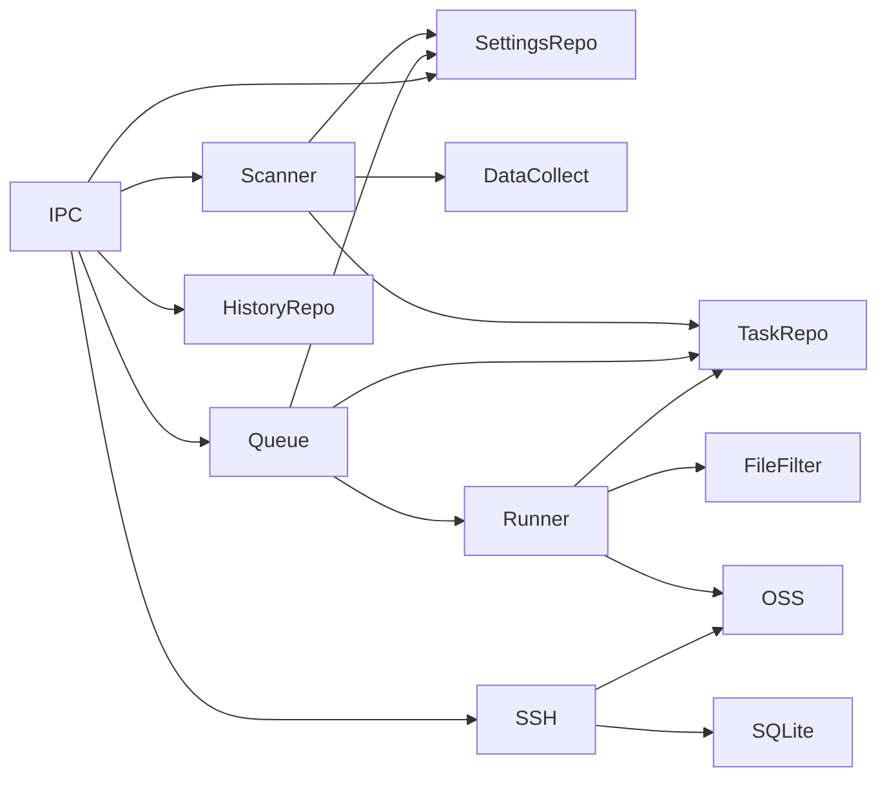

# 模块全景

## 主进程模块

| 模块 | 文件 | 职责 |
| --- | --- | --- |
| 数据库初始化 | `src/main/db/database.ts` | 创建 SQLite 连接、启用 WAL、建表和迁移 |
| 设置仓储 | `src/main/db/settings.repo.ts` | 读写设置，合并默认值，规范化后缀 |
| 任务仓储 | `src/main/db/task.repo.ts` | 创建任务、更新状态、维护文件状态和进度 |
| 历史仓储 | `src/main/db/history.repo.ts` | 基于任务表分页查询完成/失败记录 |
| IPC 注册 | `src/main/ipc/index.ts` | 暴露任务、设置、SSH、历史、标注等能力 |
| 扫描器 | `src/main/services/scanner.service.ts` | 定时扫描目录、稳定性检查、注册任务 |
| 队列服务 | `src/main/services/task-queue.service.ts` | 控制任务并发和上传时间窗口 |
| 上传执行器 | `src/main/services/task-runner.service.ts` | 扫描文件、过滤、上传、进度广播和断点恢复 |
| OSS 服务 | `src/main/services/oss-upload.service.ts` | OSS 客户端创建、连接测试、普通/分片/Buffer 上传 |
| 远程传输 | `src/main/services/ssh-rsync.service.ts` | SSH 测试、rsync 拉取、SFTP 直传 OSS |
| 数采服务 | `src/main/services/data-collect.service.ts` | 从焊接数据目录提取元信息 |
| 清理服务 | `src/main/services/cleanup.service.ts` | 按保留天数删除已完成的自动来源目录 |
| 文件过滤 | `src/main/services/file-filter.service.ts` | 白名单、黑名单、正则、后缀过滤 |

## 渲染进程模块

| 模块 | 文件 | 职责 |
| --- | --- | --- |
| 应用路由 | `src/renderer/App.tsx` | 侧边导航和页面路由 |
| IPC 客户端 | `src/renderer/lib/ipc-client.ts` | 封装 `window.api.invoke` 调用 |
| 任务状态 | `src/renderer/stores/task.store.ts` | 获取任务、保存进度事件 |
| 设置状态 | `src/renderer/stores/settings.store.ts` | 加载和自动保存设置 |
| 任务面板 | `src/renderer/pages/Dashboard.tsx` | 活跃任务、扫描、磁盘、数采、标注入口 |
| 设置页 | `src/renderer/pages/Settings.tsx` | 扫描、上传、OSS、过滤、清理配置 |
| 历史页 | `src/renderer/pages/History.tsx` | 历史分页和删除 |
| 远程机器页 | `src/renderer/pages/SSHMachines.tsx` | 远程机器 CRUD 和传输触发 |
| 标注页 | `src/renderer/pages/annotation/` | 图片标注画布、属性面板、导出上传 |

## 共享模块

| 文件 | 内容 |
| --- | --- |
| `src/shared/types.ts` | 任务、文件、设置、SSH、历史、数采、磁盘用量等类型 |
| `src/shared/constants.ts` | 应用名、默认设置、标记文件名、状态中文标签 |
| `src/shared/ipc-channels.ts` | 主进程和渲染进程共享的 IPC 通道常量 |

## 关键依赖关系

## 扩展点

- 新增云存储后端：可在 `OSSUploadService` 同层增加新的存储服务，并在执行器中抽象上传接口。
- 新增任务来源：可沿用 `sourceType`，在注册任务时写入来源和机器 ID。
- 新增文件解析：可扩展 `DataCollectService`，把更多数据目录约定转成结构化元信息。
- 新增通知渠道：当前有 Webhook 服务文件，可继续接入企业微信、钉钉或内部告警系统。
