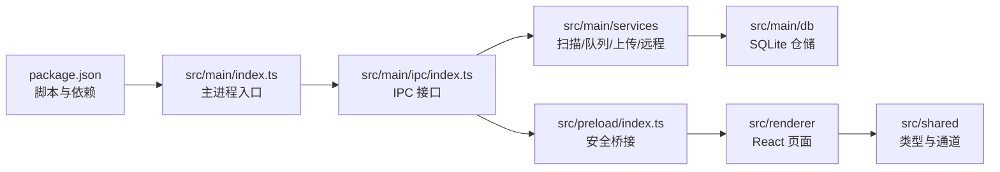

# 代码导读索引

## 阅读顺序

如果你第一次阅读这个项目，建议按下面的顺序走。这样可以先理解 Electron 分层，再进入任务上传主链路。



## 核心文件速查

| 文件 | 说明 | 适合先看什么 |
| --- | --- | --- |
| `package.json` | 依赖、开发命令、打包命令 | scripts、Electron/React/SQLite/OSS 依赖 |
| `electron.vite.config.ts` | electron-vite 构建配置 | main/preload/renderer 入口和别名 |
| `electron-builder.yml` | 安装包配置 | Linux AppImage/deb、Windows nsis |
| `src/main/index.ts` | 主进程入口 | 窗口创建、服务启动、IPC 注册 |
| `src/main/ipc/index.ts` | IPC handler 集中注册 | 前端能调用哪些主进程能力 |
| `src/main/services/scanner.service.ts` | 目录扫描和稳定性检查 | 新目录如何变成任务 |
| `src/main/services/task-queue.service.ts` | 任务队列调度 | 时间窗口和任务并发如何生效 |
| `src/main/services/task-runner.service.ts` | 单个任务上传执行 | 文件过滤、断点恢复、进度广播 |
| `src/main/services/oss-upload.service.ts` | OSS 上传封装 | 连接测试、普通上传、分片上传 |
| `src/main/services/ssh-rsync.service.ts` | 远程同步 | rsync 拉取和 SFTP 直传 |
| `src/main/db/database.ts` | SQLite 初始化 | 表结构、WAL、迁移 |
| `src/main/db/task.repo.ts` | 任务仓储 | 任务和文件状态读写 |
| `src/preload/index.ts` | 安全桥接 | `window.api` 如何暴露 |
| `src/renderer/App.tsx` | 前端路由入口 | 页面导航结构 |
| `src/renderer/pages/Dashboard.tsx` | 任务面板 | 任务列表、扫描、标注入口 |
| `src/renderer/pages/Settings.tsx` | 设置页 | 自动保存和 OSS 测试 |
| `src/shared/types.ts` | 共享类型 | Task、Settings、SSH、History 类型 |
| `src/shared/ipc-channels.ts` | IPC 通道常量 | 主进程和渲染进程的接口契约 |

## 主链路入口

最重要的业务链路是本地目录上传：

```text
ScannerService
  -> TaskRepo.create
  -> TaskQueueService.processQueue
  -> TaskRunnerService.run
  -> FileFilterService.scanFolder
  -> OSSUploadService.uploadFile
  -> TaskRepo.updateProgress / updateStatus
```

对应文档：

- [主进程代码](code/main-process.md)
- [目录扫描器](modules/scanner.md)
- [任务队列与上传执行](modules/task-upload.md)
- [OSS 上传服务](modules/oss.md)

## 前端入口

前端通过 HashRouter 分成主窗口页面和标注子窗口：

```text
src/renderer/App.tsx
  -> Dashboard
  -> Settings
  -> History
  -> SSHMachines
  -> annotation/AnnotationApp
```

对应文档：

- [渲染进程代码](code/renderer-process.md)
- [图片标注窗口](modules/annotation.md)

## 接口契约

所有跨进程交互都应先看共享契约：

- `src/shared/ipc-channels.ts`：通道名
- `src/shared/types.ts`：请求和响应中使用的主要结构
- `src/preload/index.ts`：渲染进程实际拿到的 API
- `src/main/ipc/index.ts`：主进程 handler 实现

对应文档：[共享契约与 IPC](code/shared-contracts.md)
