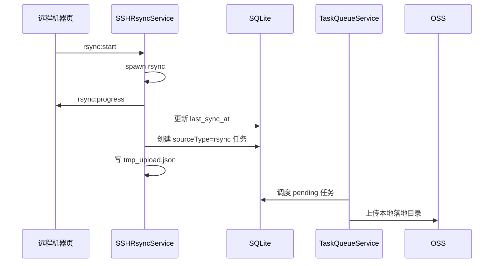

# 远程机器同步

## 添加远程机器

进入“远程机器”页，点击“添加机器”，填写：

- 名称
- 主机地址和端口
- 用户名
- 认证方式：密钥或密码
- 远程目录
- 本地目录
- 带宽限制
- CPU Nice
- 传输模式：rsync 或 SFTP

保存后先点击“测试”，确认 SSH 能连通。

## rsync 拉取流程

rsync 完成后，界面会提示“拉取完成，已自动创建上传任务”。之后可以在任务面板观察 OSS 上传进度。

## SFTP 直传流程

SFTP 直传不会创建普通任务，也不会经过任务队列：

1. 点击“直传”。
2. 递归列出远程目录文件。
3. 按文件读取 SFTP 流。
4. 上传到 OSS。
5. 更新远程机器最后同步时间。

适合轻量数据或临时补传。

## 停止传输

停止时会根据当前传输类型执行：

- rsync：向子进程发送 `SIGTERM`
- SFTP：关闭 SSH client

rsync 因为启用了 `--partial`，下次同步可利用部分文件；SFTP 直传中断后已上传对象保留，未上传对象需要重新触发。

## 常见问题

| 问题 | 排查 |
| --- | --- |
| SSH 测试失败 | 检查 host、port、用户名、密钥路径或密码 |
| rsync 启动失败 | 检查本机是否安装 `rsync`，密码模式是否安装 `sshpass` |
| 远程目录为空 | 检查路径是否以正确用户可读 |
| 上传任务未出现 | 确认 rsync 退出码为 0，查看日志 |
| SFTP 内存占用高 | 超大文件不要用 SFTP 直传，改用 rsync |
